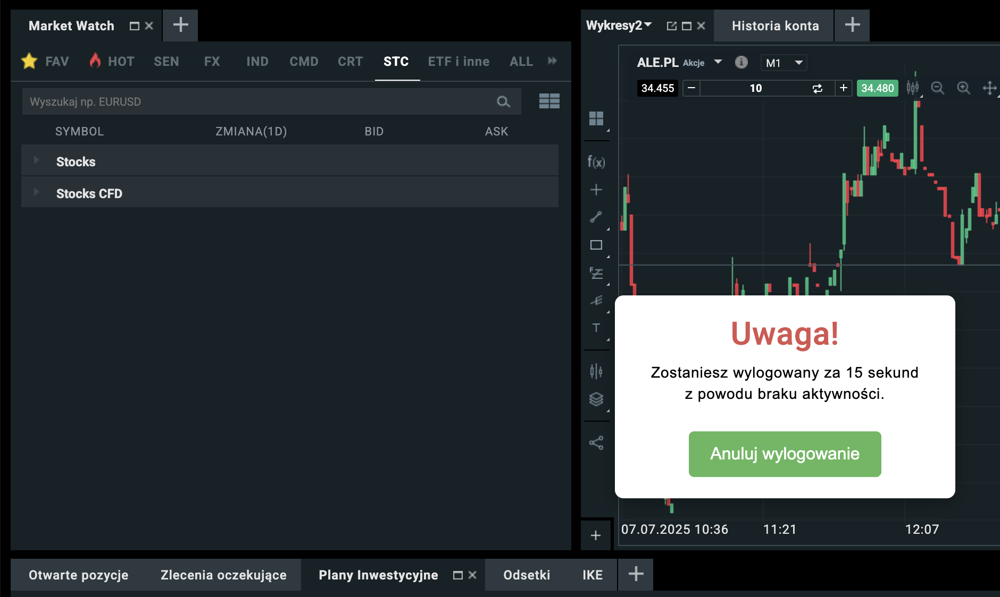

# XTB Session Guard Chrome Extension

Rozszerzenie do przeglądarki Chrome, które automatycznie wylogowuje użytkownika z platformy XTB po określonym czasie bezczynności. Przed wylogowaniem wyświetla popup z ostrzeżeniem i możliwością anulowania wylogowania.

> ⚠️ Rozszerzenie powstało po aferze związanej z kradzieżą środków z kont użytkowników XTB (m.in. z jednego konta skradziono 150 tys. zł). Więcej informacji: [Wykop - o gigantycznych, masowych kradzieżach na platformie XTB](https://wykop.pl/link/7744253/o-gigantycznych-masowych-kradziezach-na-platformie-xtb)

> ℹ️ Większość kodu w tym repozytorium została wygenerowana przez sztuczną inteligencję.



## Funkcje
- Monitorowanie bezczynności użytkownika na stronie XTB.
- Po 14 minutach bezczynności pojawia się popup z ostrzeżeniem o nadchodzącym wylogowaniu.
- Użytkownik ma 60 sekund na anulowanie wylogowania.
- Możliwość anulowania wylogowania jednym kliknięciem.
- Automatyczne wylogowanie po upływie czasu bez reakcji.

## Instalacja
1. Pobierz repozytorium lub sklonuj je do wybranego folderu:
   ```bash
   git clone https://github.com/derekqq/xtb-close-session.git
   ```
2. Otwórz Chrome i przejdź do `chrome://extensions/`.
3. Włącz tryb deweloperski (Developer mode).
4. Kliknij „Załaduj rozpakowany” (Load unpacked) i wskaż folder ze skryptami wtyczki (extension-files).

## Pliki
- `manifest.json` – konfiguracja rozszerzenia Chrome.
- `background.js` – logika działania w tle (background script).
- `content.js` – skrypt wstrzykiwany na stronę XTB, obsługuje popup i wylogowanie.
- `icon.png` – ikona rozszerzenia.

## Działanie
1. Po zainstalowaniu rozszerzenia i wejściu na platformę XTB, skrypt zaczyna monitorować aktywność użytkownika.
2. Po 14 minutach bezczynności pojawia się popup z ostrzeżeniem o wylogowaniu.
3. Użytkownik ma 60 sekund na anulowanie wylogowania.
4. Jeśli użytkownik nie zareaguje, następuje automatyczne wylogowanie.

## Wymagania
- Przeglądarka Google Chrome

---

**Uwaga:** Rozszerzenie nie jest oficjalnym produktem XTB. Używasz na własną odpowiedzialność.
